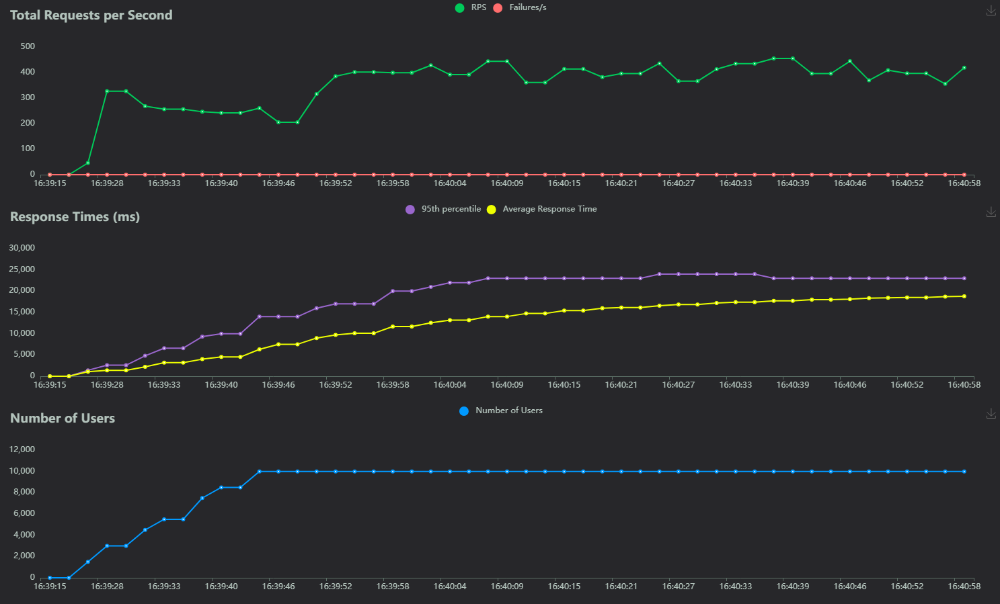
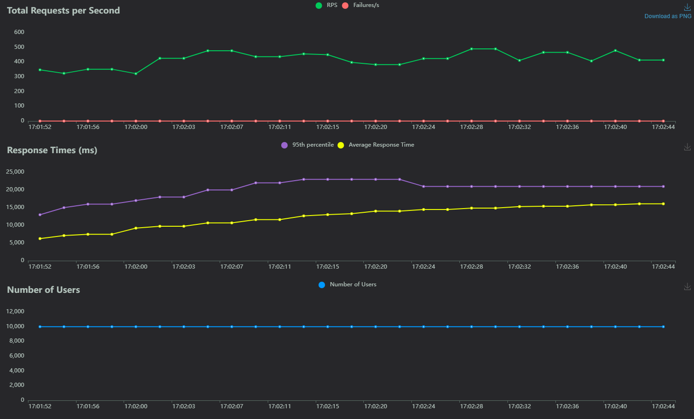
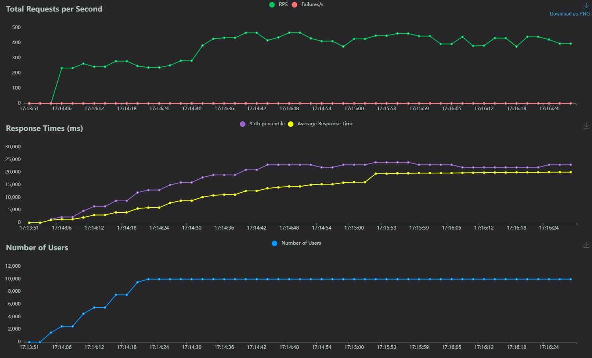
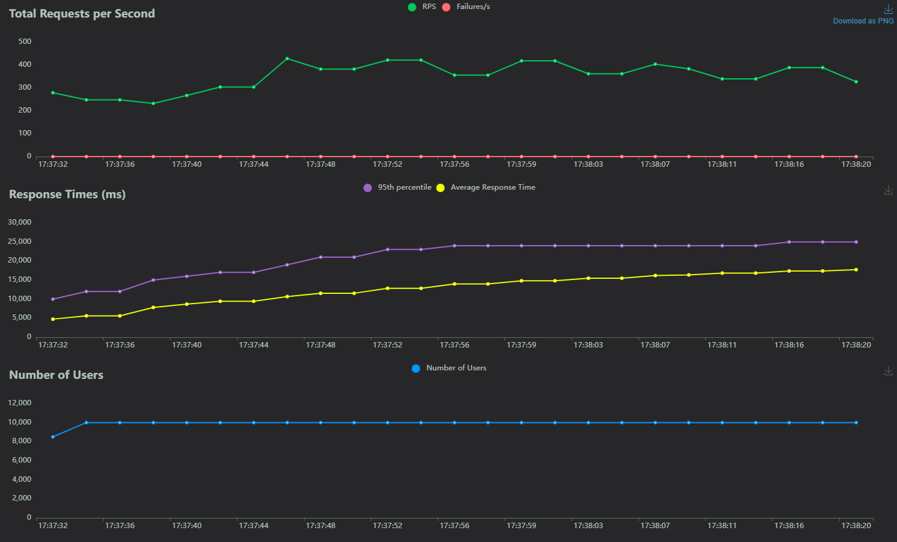
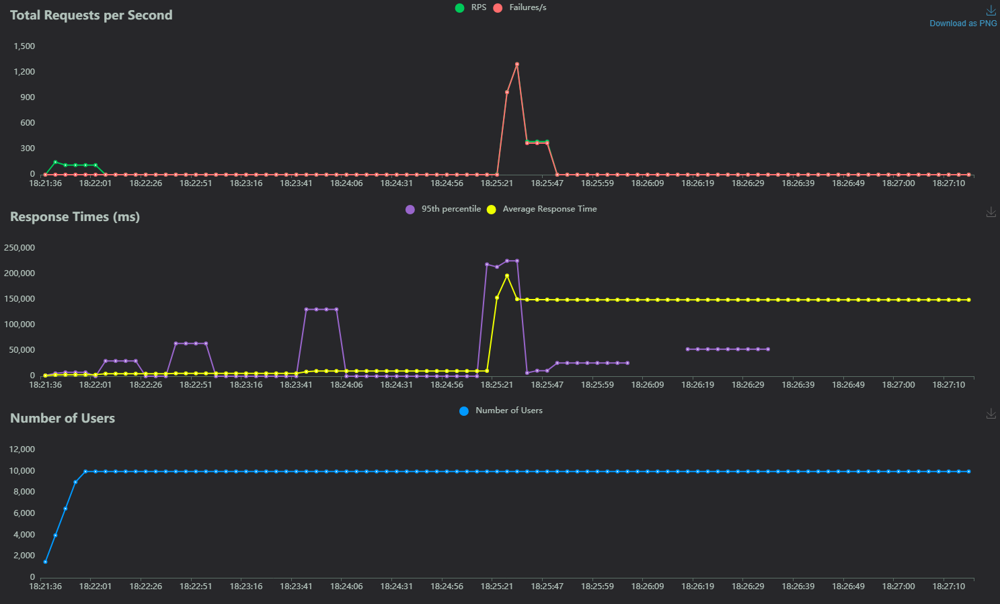

# MLOps Taller 5 - Locust con MLflow #

**Grupo compuesto por Sebastian Rodríguez y David Córdova**

Este proyecto implementa una metodología de pruebas de estres a una API que toma un modelo desde MLflow.

## Características Principales

- **Arquitectura  MLOps**: Despliegue de MLflow mediante contenedores.
- **Pipeline completo de ML**: Desde ingesta de datos hasta inferencia en producción con trazabilidad completa
- **Storage multi-capa especializado**:
  - Postgres para metadata de experimentos y modelos MLFlow
  - MinIO como S3-compatible para artefactos (modelos, plots, logs)
- **Contenerización orquestada**: Docker Compose gestiona toda la infraestructura de servicios
- **API de producción**: FastAPI consume modelos directamente desde MLFlow Registry
- **Tracking y versionado automático**: Experimentos, métricas y modelos registrados automáticamente
- **Configuración S3 local**: MinIO simula AWS S3 para desarrollo y testing
- **Locust**: App utilizada para generar tráfico en la API y validad capacidad de respuesta 

## Estructura del Proyecto

```
fastapi/
├── Dockerfile
├── main.py
└── requirements.txt

locust/
├── locustfile.py
└── requirements-locust.txt

minio/

ml-training/
├── Dockerfile
├── requirements.txt
└── train_model.py

mlflow/

register_model/
├── RegresionLogistica.pkl
└── wait_and_run.sh

docker-compose-locust.yaml
docker-compose.yaml
RegresionLogistica.pkl
requirements.txt
```

### Descripción de Componentes


**Estructura de servicios:**

- **fastapi/**:
  - **main.py**: API REST que consume modelos registrados en MLFlow para inferencia
  - **Dockerfile**: Containerización con dependencias ML y conexión a MLFlow
  - **requirements.txt**: Librerías específicas para servicio de predicciones

- **minio/**:
  - **Función**: Volume mount para almacenamiento persistente de artefactos MLFlow
  - **Contenido**: Modelos serializados, plots, logs y metadata de experimentos
  - **Acceso**: S3-compatible storage accesible desde Jupyter y MLFlow server

- **images/**:
  - **Propósito**: Documentación visual del proyecto
  - **Contenido**: Screenshots de interfaces, evidencias de funcionamiento
  - **Uso**: Soporte para README y documentación técnica
- **locust/**:
  - **función**: alojar el .py que despliega la estructura de inferencia de locust 
  **requirements**: librerías necesarias para desplegar locust
  - **Uso**: Soporte para README y documentación técnica

**Configuración de orquestación:**

- **docker-compose.yaml**:
  - **Servicios gestionados**: MinIO, Postgres, FastAPI, Mlflow
  - **Networking**: Red interna para comunicación inter-servicios
  - **Volúmenes persistentes**: postgres_data para persistencia
  - **Variables de entorno**: Configuración S3, credenciales y URIs de conexión
  - **Dependencias**: Orden de inicio optimizado para disponibilidad de servicios

  - **docker-compose-locust.yaml**:
  - **Servicios gestionados**:locust
  - **Dependencias**: FastAPI

**Servicios containerizados:**

- **MinIO Container**: S3-compatible storage (puertos 9000/9001)
- **Postgres Container**: Backend store MLFlow metadata (puerto 5432)
- **FastAPI Container**: API producción conectada a MLFlow registry (puerto 8000)
- **ml-Training Container**: Contenedor que permite la ejecución de .py que genera un modelo de ML y lo pasa a producción en Mlflow de manera automática
- **Locust Container**: Contenedor en donde se ejecuta Locust para realizar las pruebas de tráfico, depende del despliegue del contenedor de FastAPI


## Configuración de Infraestructura

### ¿Por qué esta configuración?

**Problema original:**
- Se requiere saber cual es la mínima capacidad necesaria para poder soportar 10000 usuarios haciendo request, de igual manera evaluar cómo la generación de réplicas puede optimizar el proceso, al ser el foco del taller, se buscó automatizar por completo el consumo del modelo para enfocarse en la optimización de request. Adicional, se busca consumir una imagen desde Dockerhub para el despliegue de la API

**Solución implementada:**
- Se construyó la imagen del FastAPI y se subio a Dockerhub, una vez en Dockerhub se ajustó el docker compose para consumir esa imagen directamente y desplegar el servicio.Adicionalmente, se realizaron múltiples experimentos reduciendo la capacidad de los recursos que puede tomar el contenedor de FastAPI, posteriormente se generaron réplicas para evaluar el desempeño de la API.

### Componentes de Configuración

```bash
# Variables de entorno clave para la conexión de mlflow y fastapi
- MLFLOW_TRACKING_URI

**Función:** realiza la conexión entre FastAPI y Mlflow.
```


### Docker Compose maneja automáticamente:
- Creación de redes internas
- Montaje de volúmenes persistentes
- Orden de dependencias entre servicios
- Variables de entorno para cada container


## Conexiones Configuradas

### Conexión de FastAPI con Mlflow

```yaml
# Tracking server de MLflow
        mlflow.set_tracking_uri(os.getenv("MLFLOW_TRACKING_URI", "http://mlflow:5000"))
```
* Genera la conexión directa entre ambos servicios para poder generar la inferencia desde fastAPI tomando los modelos que vayamos desplegando en producción desde Mlflow
### Conexión de Locust a FastAPI

```yaml
# environment:
      - LOCUST_HOST=http://10.43.100.98:8000
```
## Flujo del Pipeline

### Secuencia de Ejecución:

1. docker compose up
2. Servicios iniciando (Minio+ Postgres + MlFlow + Fastapi + Python Env)
3. docker compose docker-compose-locust up
4. Servicio de Locust iniciado.
5. Definir parámetros de pruebas de estres 
6. Realizar pruebas de estres reduciendo capacidad hasta llegar al mínimo posible 


## Explicación train_model-py (ejecucion.py)

Este script tiene todo el flujo correspondiente a la ingesta de información, entrenamiento, experimentos y paso a producción del modelo

1. **Preparación de la base de datos**
   - Crea el Df de palmerpenguins

2. **Carga y limpieza de datos**
   - Limpia y transforma los datos (One-Hot Encoding, manejo de NaN) 

3. **Entrenamiento del modelo**
   - Guarda todos los logs del experimento en 

4. **Paso a producción del modelo seleccionado**
   - Se ejecuta un comando para que Mlflow ponga el modelo seleccionado en producción y pueda ser consumido por la API


**Configuración FastAPI**

Framework: FastAPI v3.0.0
Propósito: Predecir especies de pingüinos (Adelie, Chinstrap, Gentoo)
Optimizado para baja latencia y alta concurrencia

**Modelo de datos (PenguinFeatures)**
Recibe 10 características del pingüino:

Medidas físicas: longitud/profundidad del pico, longitud de aleta, masa corporal
Variables categóricas: año, isla (Biscoe/Dream/Torgersen), sexo (female/male)
Todas con validación (valores >= 0)

**Carga del modelo (startup)**

Conecta con MLflow para descargar el modelo
Usa MinIO como storage backend (S3-compatible)
Carga el modelo reg_logistica en estado Production
Cachea el modelo en memoria para predicciones instantáneas
Ejecuta un test de predicción inicial para validar funcionamiento

**Endpoints**

POST /predict: Recibe características, retorna especie predicha con latencia <10ms
GET /health: Estado del servicio y modelo
GET /model-info: Información técnica del modelo cacheado

**Ventaja clave**:
El modelo se carga una sola vez en memoria al iniciar, eliminando el overhead de MLflow en cada predicción. Esto permite latencias ultra-bajas (<10ms) ideal para producción de alto tráfico.


```


**Resultado final:**  
Se obtiene un modelo de clasificación entrenado y validado automáticamente, listo para ser consumido desde FastAPI.


## Instrucciones de Ejecución

### Preparación Inicial

```bash
# Clonar el repositorio
git clone (https://github.com/DAVID316CORDOVA/MLOps_Taller5)
cd MLOps_Taller5

# Limpiar entorno previo (si existe)
docker compose down -v
docker system prune -f

```

### Ejecución 

```bash
# Después de la preparación inicial, simplemente:
docker compose up
```
```bash
#Levantar el servicio de Locust
docker compose docker-compose-locust up
```


**Qué sucede**
- Se crean todos los contenedores necesarios
- Se entrena el modelo, se carga y pasa a producción en MLflow de manera automática
- La API consume los modelos para hacer la inferencia
- Se carga el Locust para poder realizar las pruebas de estrés


## Acceso a Servicios

| Servicio | URL | Credenciales | Descripción |
|----------|-----|--------------|-------------|
| **Mlflow Web** | http://localhost:5005 | admin/admin | Dashboard del pipeline |
| **FastAPI Docs** | http://localhost:8000/docs | - | API de predicciones |
| **Postgres** | http://localhost:5432 | mlflow_user:mlflow_password | Postgres|
| **Minio** | http://localhost:9000 | admin:supersecret | |
| **Locust** | http://localhost:8089 |  | App de pruebas |


## Ejecución del Proyecto

### 1. Despliegue de servicios necesarios (MLflow, FastAPI, Locust)


### 2. Primera prueba con todos los recursos disponibles


### 3. 1ra disminución de recursos (2cpu 4ram)


## 4. 2da disminución de recursos (1.5cpu 3ram)


## 5. 3ra disminución de recursos (1cpu 2ram) 



## 6. 4ta disminución de recursos(0.75cpu 1ram)


## 7. 5ta disminución de recursos(0.75cpu 0.256ram) - Fallo


## 7. Validación de experimentos creados 


## 8. Revisión de accuraccy


## 9. inferencia en FastAPI una vez creado el modelo


### funciones notebook - Lógica del Pipeline

```python

#Crea las tablas en MySQL

import MySQLdb   # mysqlclient se importa como MySQLdb

connection = MySQLdb.connect(
    host="mysql",          # nombre del servicio en docker-compose
    user="my_app_user",
    passwd="my_app_pass",  # OJO: aquí se usa 'passwd' en lugar de 'password'
    db="my_app_db",
    port=3306
)

cursor = connection.cursor()

# Ejecutar tus queries
cursor.execute("DROP TABLE IF EXISTS penguins_raw;")
cursor.execute("""
CREATE TABLE penguins_raw (
    species VARCHAR(50) NULL,
    island VARCHAR(50) NULL,
    bill_length_mm DOUBLE NULL,
    bill_depth_mm DOUBLE NULL,
    flipper_length_mm DOUBLE NULL,
    body_mass_g DOUBLE NULL,
    sex VARCHAR(10) NULL,
    year INT NULL
);
""")

cursor.execute("DROP TABLE IF EXISTS penguins_clean;")
cursor.execute("""
CREATE TABLE penguins_clean (
    species INT NULL,
    bill_length_mm DOUBLE NULL,
    bill_depth_mm DOUBLE NULL,
    flipper_length_mm DOUBLE NULL,
    body_mass_g DOUBLE NULL,
    year INT NULL,
    island_Biscoe INT NULL,
    island_Dream INT NULL,
    island_Torgersen INT NULL,
    sex_female INT NULL,
    sex_male INT NULL
);
""")


connection.commit()
connection.close()

#Inserta la información cruda 

import palmerpenguins as pp
from palmerpenguins import load_penguins
import pandas as pd
"""
Función para insertar datos en la tabla MySQL
"""
TABLE_NAME = "penguins_raw"
df = pp.load_penguins()


connection = MySQLdb.connect(
    host="mysql",          # nombre del servicio en docker-compose
    user="my_app_user",
    passwd="my_app_pass",  # OJO: aquí se usa 'passwd' en lugar de 'password'
    db="my_app_db",
    port=3306
)

cursor = connection.cursor()

for _, row in df.iterrows():
    sql = f"""
    INSERT INTO {TABLE_NAME} 
    (species, island, bill_length_mm, bill_depth_mm, flipper_length_mm, body_mass_g, sex, year)
    VALUES (%s, %s, %s, %s, %s, %s, %s, %s)
    """
    values = (
        row["species"],
        row["island"],
        None if pd.isna(row["bill_length_mm"]) else float(row["bill_length_mm"]),
        None if pd.isna(row["bill_depth_mm"]) else float(row["bill_depth_mm"]),
        None if pd.isna(row["flipper_length_mm"]) else float(row["flipper_length_mm"]),
        None if pd.isna(row["body_mass_g"]) else float(row["body_mass_g"]),
        row["sex"] if pd.notna(row["sex"]) else None,
        int(row["year"]),
    )
    
    cursor.execute(sql, values)

connection.commit()
connection.close()


#Trae la información desde MySQL
conn = MySQLdb.connect(
    host="mysql",          # nombre del servicio en docker-compose
    user="my_app_user",
    passwd="my_app_pass",  # OJO: aquí se usa 'passwd' en lugar de 'password'
    db="my_app_db",
    port=3306
)

query = "SELECT * FROM penguins_raw"
df = pd.read_sql(query, conn)

#Limpia los datos 

from sklearn.preprocessing import OneHotEncoder
import numpy as np

df[df.isna().any(axis=1)]
df.dropna(inplace=True)
categorical_cols = ['sex','island']
encoder = OneHotEncoder(handle_unknown='ignore')
x = df.drop(columns=['species'])
y = df['species']
x_encoded = encoder.fit_transform(x[categorical_cols])
X_numeric = x.drop(columns=categorical_cols)
X_final = np.hstack((X_numeric.values, x_encoded.toarray()))

df_encoded = pd.get_dummies(df, columns=['island','sex'])
bool_cols = df_encoded.select_dtypes(include='bool').columns
df_encoded[bool_cols] = df_encoded[bool_cols].astype(int)
df_encoded.head()
df_encoded['species'] = df_encoded['species'].apply(lambda x: 
                        1 if x == 'Adelie' else 
                        2 if x == 'Chinstrap' else 
                        3 if x == 'Gentoo' else 
                        None)
# Inserta la información limpia en MySQL
TABLE_NAME = "penguins_clean"

connection = MySQLdb.connect(
    host="mysql",          # nombre del servicio en docker-compose
    user="my_app_user",
    passwd="my_app_pass",  # OJO: aquí se usa 'passwd' en lugar de 'password'
    db="my_app_db",
    port=3306
)

cursor = connection.cursor()

insert_sql = """
    INSERT INTO penguins_clean (
        species, bill_length_mm, bill_depth_mm, flipper_length_mm, 
        body_mass_g, year, island_Biscoe, island_Dream, island_Torgersen, 
        sex_female, sex_male
    )
    VALUES (%s, %s, %s, %s, %s, %s, %s, %s, %s, %s, %s)
"""

# Genera los valores a insertar
values = [
    (
        int(row["species"]),
        None if pd.isna(row["bill_length_mm"]) else float(row["bill_length_mm"]),
        None if pd.isna(row["bill_depth_mm"]) else float(row["bill_depth_mm"]),
        None if pd.isna(row["flipper_length_mm"]) else float(row["flipper_length_mm"]),
        None if pd.isna(row["body_mass_g"]) else float(row["body_mass_g"]),
        int(row["year"]),
        int(row["island_Biscoe"]),
        int(row["island_Dream"]),
        int(row["island_Torgersen"]),
        int(row["sex_female"]),
        int(row["sex_male"]),
    )
    for _, row in df_encoded.iterrows()
]

# Inserta múltiples filas
cursor.executemany(insert_sql, values)

# Confirma los cambios
connection.commit()

# Cierra conexión
cursor.close()
connection.close()

#Trae la data limpia para entrenar el modelo
conn = MySQLdb.connect(
    host="mysql",          # nombre del servicio en docker-compose
    user="my_app_user",
    passwd="my_app_pass",  # OJO: aquí se usa 'passwd' en lugar de 'password'
    db="my_app_db",
    port=3306
)

query = "SELECT * FROM penguins_clean"
df_limpio = pd.read_sql(query, conn)

#Trae la data limpia para entrenar el modelo
conn = MySQLdb.connect(
    host="mysql",          # nombre del servicio en docker-compose
    user="my_app_user",
    passwd="my_app_pass",  # OJO: aquí se usa 'passwd' en lugar de 'password'
    db="my_app_db",
    port=3306
)

query = "SELECT * FROM penguins_clean"
df_limpio = pd.read_sql(query, conn)

import mlflow
import mlflow.sklearn
from sklearn.model_selection import train_test_split
from sklearn.metrics import accuracy_score
 
# Modelos
from sklearn.linear_model import LogisticRegression
from sklearn.ensemble import RandomForestClassifier, GradientBoostingClassifier, AdaBoostClassifier
from sklearn.svm import SVC
from sklearn.neighbors import KNeighborsClassifier
from sklearn.tree import DecisionTreeClassifier
 
# ==============================
# 1. Conectar con tu MLflow server
# ==============================
mlflow.set_tracking_uri("http://10.43.100.83:5005")  # Ajusta según tu servidor MLflow
 
# ==============================
# 2. Preparar dataset
# ==============================
df = df_limpio  # tu DataFrame limpio
X = df.drop("species", axis=1)
y = df["species"]
 
X_train, X_test, y_train, y_test = train_test_split(
    X, y, test_size=0.2, random_state=42
)
 
# ==============================
# 3. Definir modelos y sus hiperparámetros
# ==============================
model_params = {
    "logistic_regression": {
        "model": LogisticRegression,
        "params": [
            {"C": 0.1, "max_iter": 5000, "solver": "lbfgs"},
            {"C": 1, "max_iter": 5000, "solver": "lbfgs"},
            {"C": 10, "max_iter": 5000, "solver": "lbfgs"}
        ]
    },
    "random_forest": {
        "model": RandomForestClassifier,
        "params": [
            {"n_estimators": 50, "max_depth": 5, "random_state": 42},
            {"n_estimators": 100, "max_depth": 10, "random_state": 42},
            {"n_estimators": 200, "max_depth": None, "random_state": 42},
        ]
    },
    "gradient_boosting": {
        "model": GradientBoostingClassifier,
        "params": [
            {"n_estimators": 50, "learning_rate": 0.1, "max_depth": 3},
            {"n_estimators": 100, "learning_rate": 0.05, "max_depth": 3},
            {"n_estimators": 150, "learning_rate": 0.01, "max_depth": 4},
        ]
    },
    "adaboost": {
        "model": AdaBoostClassifier,
        "params": [
            {"n_estimators": 50, "learning_rate": 0.5},
            {"n_estimators": 100, "learning_rate": 1.0},
            {"n_estimators": 150, "learning_rate": 1.5},
        ]
    },
    "svc": {
        "model": SVC,
        "params": [
            {"C": 0.1, "kernel": "linear", "probability": True},
            {"C": 1, "kernel": "rbf", "probability": True},
            {"C": 10, "kernel": "poly", "probability": True},
        ]
    },
    "knn": {
        "model": KNeighborsClassifier,
        "params": [
            {"n_neighbors": 3, "weights": "uniform"},
            {"n_neighbors": 5, "weights": "distance"},
            {"n_neighbors": 7, "weights": "uniform"},
        ]
    },
    "decision_tree": {
        "model": DecisionTreeClassifier,
        "params": [
            {"max_depth": 3, "min_samples_split": 2},
            {"max_depth": 5, "min_samples_split": 4},
            {"max_depth": None, "min_samples_split": 2},
        ]
    }
}
 
# ==============================
# 4. Entrenar y loggear cada experimento por separado
# ==============================
for model_name, mp in model_params.items():
    ModelClass = mp["model"]
    for i, params in enumerate(mp["params"]):
        # Crear un experimento único por combinación
        experiment_name = f"{model_name}_exp_{i+1}"
        mlflow.set_experiment(experiment_name)  # crea o selecciona el experimento
 
        with mlflow.start_run(run_name=f"{model_name}_run") as run:
            # Entrenar modelo
            model = ModelClass(**params)
            model.fit(X_train, y_train)
            y_pred = model.predict(X_test)
            acc = accuracy_score(y_test, y_pred)
 
            # Log de métricas
            mlflow.log_metric("accuracy", acc)
 
            # Log de hiperparámetros
            for k, v in params.items():
                mlflow.log_param(k, v)
 
            # Log del modelo como artifact
            mlflow.sklearn.log_model(sk_model=model, artifact_path="model")
 
            # Registrar en Model Registry
            model_uri = f"runs:/{run.info.run_id}/model"
            mlflow.register_model(model_uri=model_uri, name=f"{model_name}_model")
 
            print(f"{experiment_name} entrenado y logueado con accuracy: {acc}")

#Pasa el modelo a producción

from mlflow.tracking import MlflowClient

# Conexión al server
mlflow.set_tracking_uri("http://10.43.100.98:5005")
client = MlflowClient()

# Actualizar a producción
model_name = "reg_logistica"
model_version = 1  # la primera versión que acabas de crear

client.transition_model_version_stage(
    name=model_name,
    version=model_version,
    stage="Production",
    archive_existing_versions=True  # mueve versiones anteriores a Archived
)

print(f"Modelo {model_name} v{model_version} promovido a Production")

```


## Conclusiones

Conclusiones

La implementación realizada demuestra cómo integrar de manera efectiva distintos servicios (MySQL, Postgres, MinIO, Jupyter, FastAPI y MLflow) en un entorno contenerizado con Docker Compose, logrando un flujo completo de MLOps.

Se logró establecer un pipeline automatizado que cubre todas las etapas: ingesta de datos, limpieza, entrenamiento, experimentación, registro de modelos, despliegue y consumo en producción.

El uso de MLflow con backend en Postgres y artefactos en MinIO garantiza trazabilidad, persistencia y escalabilidad en comparación con la configuración por defecto en SQLite.

La conexión entre FastAPI y MLflow permite consumir modelos directamente desde el registro, habilitando predicciones en tiempo real y demostrando un caso de uso cercano a un escenario de producción.

El notebook desarrollado constituye un ejemplo reproducible de todo el flujo de trabajo, desde la preparación de la base de datos hasta la promoción de un modelo en producción, lo que refuerza la importancia de la automatización y reproducibilidad en proyectos de ciencia de datos.

En general, este proyecto evidencia la viabilidad y relevancia de aplicar prácticas de MLOps en entornos académicos y profesionales, sirviendo como base para escalar a soluciones más complejas en el futuro.

---

**Desarrollado por:**
- Sebastian Rodríguez  
- David Córdova

**Proyecto:** MLOps Taller 4 - Mlflow
**Fecha:** Septiembre 2025
