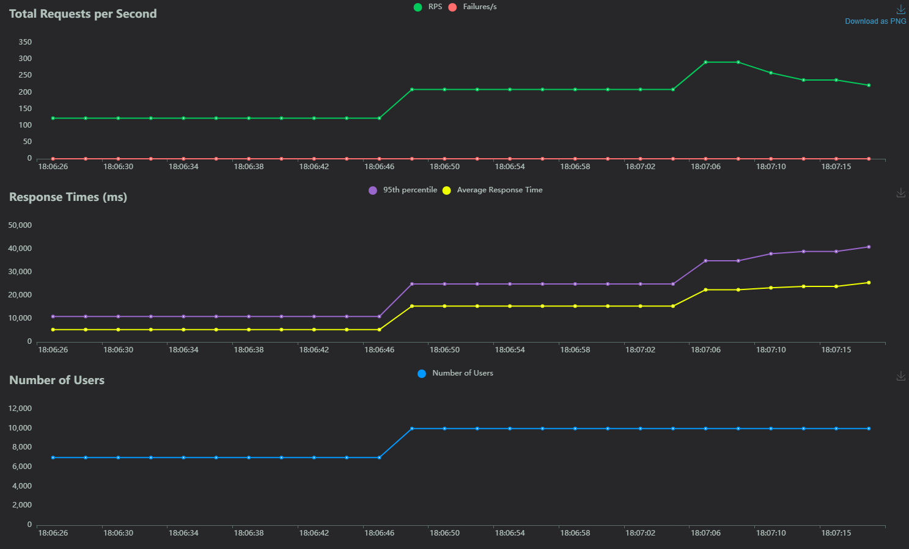
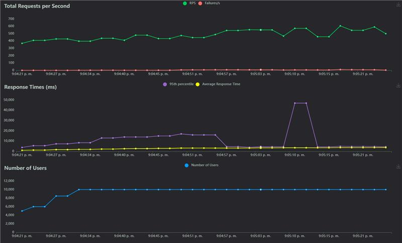

# MLOps Taller 5 - Locust con MLflow #

**Grupo compuesto por Sebastian Rodríguez y David Córdova**

Este proyecto implementa una metodología de pruebas de estres a una API que toma un modelo desde MLflow.

## Características Principales

- **Arquitectura  MLOps**: Despliegue de MLflow mediante contenedores.
- **Pipeline completo de ML**: Desde ingesta de datos hasta inferencia en producción con trazabilidad completa
- **Storage multi-capa especializado**:
  - Postgres para metadata de experimentos y modelos MLFlow
  - MinIO como S3-compatible para artefactos (modelos, plots, logs)
- **Contenerización orquestada**: Docker Compose gestiona toda la infraestructura de servicios
- **API de producción**: FastAPI consume modelos directamente desde MLFlow Registry
- **Tracking y versionado automático**: Experimentos, métricas y modelos registrados automáticamente
- **Configuración S3 local**: MinIO simula AWS S3 para desarrollo y testing
- **Locust**: App utilizada para generar tráfico en la API y validad capacidad de respuesta 

## Estructura del Proyecto

```
fastapi/
├── Dockerfile
├── main.py
└── requirements.txt

locust/
├── locustfile.py

minio/

ml-training/
├── Dockerfile
├── requirements.txt
└── train_model.py

register_model/
├── RegresionLogistica.pkl
└── wait_and_run.sh

docker-compose-locust.yaml
docker-compose.yaml
docker-compose-replicas.yaml
RegresionLogistica.pkl
requirements.txt
```

### Descripción de Componentes


**Estructura de servicios:**

- **fastapi/**:
  - **main.py**: API REST que consume modelos registrados en MLFlow para inferencia
  - **Dockerfile**: Containerización con dependencias ML y conexión a MLFlow
  - **requirements.txt**: Librerías específicas para servicio de predicciones

- **minio/**:
  - **Función**: Volume mount para almacenamiento persistente de artefactos MLFlow
  - **Contenido**: Modelos serializados, plots, logs y metadata de experimentos
  - **Acceso**: S3-compatible storage accesible desde Jupyter y MLFlow server

- **images/**:
  - **Propósito**: Documentación visual del proyecto
  - **Contenido**: Screenshots de interfaces, evidencias de funcionamiento
  - **Uso**: Soporte para README y documentación técnica
- **locust/**:
  - **función**: alojar el .py que despliega la estructura de inferencia de locust 
  **requirements**: librerías necesarias para desplegar locust
  - **Uso**: Soporte para README y documentación técnica

**Configuración de orquestación:**

- **docker-compose.yaml**:
  - **Servicios gestionados**: MinIO, Postgres, FastAPI, Mlflow
  - **Networking**: Red interna para comunicación inter-servicios
  - **Volúmenes persistentes**: postgres_data para persistencia
  - **Variables de entorno**: Configuración S3, credenciales y URIs de conexión
  - **Dependencias**: Orden de inicio optimizado para disponibilidad de servicios
 
- **docker-compose-replicas.yaml**:
  - **Servicios gestionados**: MinIO, Postgres, FastAPI, Mlflow
  - **Networking**: Red interna para comunicación inter-servicios
  - **Volúmenes persistentes**: postgres_data para persistencia
  - **Variables de entorno**: Configuración S3, credenciales y URIs de conexión
  - **Dependencias**: Orden de inicio optimizado para disponibilidad de servicios
  - **observaciones**: Se generó un compose nuevo para hacer las pruebas de múltiples instancias

  - **docker-compose-locust.yaml**:
  - **Servicios gestionados**:locust
  - **Dependencias**: FastAPI

**Servicios containerizados:**

- **MinIO Container**: S3-compatible storage (puertos 9000/9001)
- **Postgres Container**: Backend store MLFlow metadata (puerto 5432)
- **FastAPI Container**: API producción conectada a MLFlow registry (puerto 8000)
- **ml-Training Container**: Contenedor que permite la ejecución de .py que genera un modelo de ML y lo pasa a producción en Mlflow de manera automática
- **Locust Container**: Contenedor en donde se ejecuta Locust para realizar las pruebas de tráfico, depende del despliegue del contenedor de FastAPI


## Configuración de Infraestructura

### ¿Por qué esta configuración?

**Problema original:**
- Se requiere saber cual es la mínima capacidad necesaria para poder soportar 10000 usuarios haciendo request, de igual manera evaluar cómo la generación de réplicas puede optimizar el proceso, al ser el foco del taller, se buscó automatizar por completo el consumo del modelo para enfocarse en la optimización de request. Adicional, se busca consumir una imagen desde Dockerhub para el despliegue de la API

**Solución implementada:**
- Se construyó la imagen del FastAPI y se subio a Dockerhub, una vez en Dockerhub se ajustó el docker compose para consumir esa imagen directamente y desplegar el servicio.Adicionalmente, se realizaron múltiples experimentos reduciendo la capacidad de los recursos que puede tomar el contenedor de FastAPI, posteriormente se generaron réplicas para evaluar el desempeño de la API.

### Componentes de Configuración

```bash
# Variables de entorno clave para la conexión de mlflow y fastapi
- MLFLOW_TRACKING_URI

**Función:** realiza la conexión entre FastAPI y Mlflow.
```


### Docker Compose maneja automáticamente:
- Creación de redes internas
- Montaje de volúmenes persistentes
- Orden de dependencias entre servicios
- Variables de entorno para cada container


## Conexiones Configuradas

### Conexión de FastAPI con Mlflow

```yaml
# Tracking server de MLflow
        mlflow.set_tracking_uri(os.getenv("MLFLOW_TRACKING_URI", "http://mlflow:5000"))
```
* Genera la conexión directa entre ambos servicios para poder generar la inferencia desde fastAPI tomando el modelo que vayamos desplegando en producción desde Mlflow
### Conexión de Locust a FastAPI

```yaml
# environment:
      - LOCUST_HOST=http://fastapi:8000
```
## Flujo del Pipeline

### Secuencia de Ejecución:

1. docker compose up
2. Servicios iniciando (Minio+ Postgres + MlFlow + Fastapi + Python Env)
3. docker compose docker-compose-locust up
4. Servicio de Locust iniciado.
5. Definir parámetros de pruebas de estres 
6. Realizar pruebas de estres reduciendo capacidad hasta llegar al mínimo posible 


## Explicación train_model-py (ejecucion.py)

Este script tiene todo el flujo correspondiente a la ingesta de información, entrenamiento, experimentos y paso a producción del modelo

1. **Preparación de la base de datos**
   - Crea el Df de palmerpenguins

2. **Carga y limpieza de datos**
   - Limpia y transforma los datos (One-Hot Encoding, manejo de NaN) 

3. **Entrenamiento del modelo**
   - Guarda todos los logs del experimento en 

4. **Paso a producción del modelo seleccionado**
   - Se ejecuta un comando para que Mlflow ponga el modelo seleccionado en producción y pueda ser consumido por la API


**Configuración FastAPI**

Propósito: Predecir especies de pingüinos (Adelie, Chinstrap, Gentoo)
Optimizado para baja latencia y alta concurrencia

**Modelo de datos (PenguinFeatures)**
Recibe 10 características del pingüino:

Medidas físicas: longitud/profundidad del pico, longitud de aleta, masa corporal
Variables categóricas: año, isla (Biscoe/Dream/Torgersen), sexo (female/male)
Todas con validación (valores >= 0)

**Carga del modelo (startup)**

Conecta con MLflow para descargar el modelo
Usa MinIO como storage backend (S3-compatible)
Carga el modelo reg_logistica en estado Production
Cachea el modelo en memoria para predicciones instantáneas
Ejecuta un test de predicción inicial para validar funcionamiento

**Endpoints**

POST /predict: Recibe características, retorna especie predicha con latencia <10ms
GET /health: Estado del servicio y modelo
GET /model-info: Información técnica del modelo cacheado

**Ventaja clave**:
El modelo se carga una sola vez en memoria al iniciar, eliminando el overhead de MLflow en cada predicción. Esto permite latencias ultra-bajas (<10ms) ideal para producción de alto tráfico.


```


**Resultado final:**  
Se obtiene un modelo de clasificación entrenado y validado automáticamente, listo para ser consumido desde FastAPI.


## Instrucciones de Ejecución

### Preparación Inicial

```bash
# Clonar el repositorio
git clone (https://github.com/DAVID316CORDOVA/MLOps_Taller5)
cd MLOps_Taller5

# Limpiar entorno previo (si existe)
docker compose down -v
docker system prune -f

```

### Ejecución 

```bash
# Después de la preparación inicial, simplemente:
docker compose up
```
```bash
#Levantar el servicio de Locust
docker compose docker-compose-locust up
```


**Qué sucede**
- Se crean todos los contenedores necesarios
- Se entrena el modelo, se carga y pasa a producción en MLflow de manera automática
- La API consume el modelo para hacer la inferencia
- Se carga el Locust para poder realizar las pruebas de estrés


## Acceso a Servicios

| Servicio | URL | Credenciales | Descripción |
|----------|-----|--------------|-------------|
| **Mlflow Web** | http://localhost:5005 | admin/admin | Dashboard del pipeline |
| **FastAPI Docs** | http://localhost:8000/docs | - | API de predicciones |
| **Postgres** | http://localhost:5432 | mlflow_user:mlflow_password | Postgres|
| **Minio** | http://localhost:9000 | admin:supersecret | |
| **Locust** | http://localhost:8089 |  | App de pruebas |


## Ejecución del Proyecto

### 1. Despliegue de servicios necesarios (MLflow, FastAPI, Locust)


### 2.Evaluación de Recursos Disponibles para los Experimentos
**Resultados:**


**Resumen:**
- Memoria RAM: 15 GiB  
- Swap: 4 GiB  
- CPU: 4 núcleos Intel Xeon (2.40 GHz)  
- Sistema operativo: Rocky Linux


#### Dado que la máquina virtual contaba con 15 GB de RAM y 4 CPU, se realizaron pruebas variando los recursos asignados a los contenedores de FastAPI para evaluar el rendimiento del sistema bajo diferentes configuraciones.


### 3. Primera prueba con todos los recursos disponibles


### 4. 1ra disminución de recursos (2 CPU  - 4 GB RAM)


## 5. 2da disminución de recursos (1.5 CPU - 3 GB RAM)


## 6. 3ra disminución de recursos (1 CPU 2 GB RAM) 


## 7. 4ta disminución de recursos(0.75 CPU - 1.5 GB RAM)


## 8. 5ta disminución de recursos(0.5 CPU - 512 MB RAM) 



## 9. 6ta disminución de recursos(0.5 CPU - 256 MB RAM) - Fallo


## Resumen resultados
| Configuración         | RPS Máximo | RPS Promedio | Tiempo Resp. Avg (ms) | Tiempo Resp. P95 (ms) | Usuarios Máx | Fallas/s | Estado   |
|-----------------------|------------|--------------|----------------------|----------------------|--------------|----------|------------|
| 0.5CPU - 256 MB RAM   | ~350       | ~100         | ~145,000             | ~220,000             | 10000        | 1,200+   | Colapsó    |
| 0.5 CPU - 512 MB RAM  | ~300       | ~220         | ~48,000              | ~48,000              | 10000        | 0        | Estable    |
| 0.5 CPU - 1 GB RAM    | ~280       | ~240         | ~26,000              | ~37,000              | 10000        | 0        | Estable    |
| 0.75 CPU - 1.5 GB RAM | ~420       | ~360         | ~17,000              | ~24,000              | 10000        | 0        | Estable    |
| 1.5 CPU - 3 GB RAM    | ~490       | ~420         | ~16,000              | ~22,000              | 10000        | 0        | Estable    |
| 1 CPU - 2 GB RAM      | ~470       | ~390         | ~20,000              | ~23,000              | 10000        | 0        | Estable    |
| 2 CPU - 4 GB RAM      | ~450       | ~370         | ~18,000              | ~23,000              | 10000        | 0        | Estable    |
| 4 CPU - 16 GB RAM     | ~370       | ~330         | ~8,500               | ~18,000              | 10000        | 0        | Óptimo     |


### Código para la lectura,limpieza y transformación de datos y para el entrenamiento del modelo de Regresión Logística

```python

import numpy as np 
import mlflow
import mlflow.sklearn
import pandas as pd
from sklearn.preprocessing import OneHotEncoder
from sklearn.model_selection import train_test_split
from sklearn.metrics import accuracy_score
import palmerpenguins as pp
from sklearn.linear_model import LogisticRegression
from mlflow.tracking import MlflowClient
import os
import time

# Esperar un poco para asegurar que MLflow esté completamente listo
time.sleep(10)

# ============================================================
# 1. Cargar y preparar los datos
# ============================================================
print("Cargando datos de penguins...")
df = pp.load_penguins()
df.dropna(inplace=True)

# Codificar variables categóricas
categorical_cols = ['sex', 'island']
encoder = OneHotEncoder(handle_unknown='ignore')
x = df.drop(columns=['species'])
y = df['species']
x_encoded = encoder.fit_transform(x[categorical_cols])
X_numeric = x.drop(columns=categorical_cols)
X_final = np.hstack((X_numeric.values, x_encoded.toarray()))

# Codificación simple con pandas (opcional, más legible)
df_encoded = pd.get_dummies(df, columns=['island', 'sex'])
bool_cols = df_encoded.select_dtypes(include='bool').columns
df_encoded[bool_cols] = df_encoded[bool_cols].astype(int)
df_encoded['species'] = df_encoded['species'].apply(lambda x:
                        1 if x == 'Adelie' else
                        2 if x == 'Chinstrap' else
                        3 if x == 'Gentoo' else None)

# ============================================================
# 2. Configurar MLflow
# ============================================================
mlflow_uri = os.getenv("MLFLOW_TRACKING_URI", "http://mlflow:5000")
print(f" Conectando a MLflow en {mlflow_uri}")
mlflow.set_tracking_uri(mlflow_uri)
mlflow.set_experiment("experimento")

# ============================================================
# 3. Entrenar el modelo
# ============================================================
print("Entrenando modelo...")
df = df_encoded
X = df.drop("species", axis=1)
y = df["species"]

X_train, X_test, y_train, y_test = train_test_split(
    X, y, test_size=0.2, random_state=42
)

model = LogisticRegression(max_iter=5000)
model.fit(X_train, y_train)

# ============================================================
# 4. Loguear y registrar el modelo en MLflow
# ============================================================
print("Registrando modelo en MLflow...")
with mlflow.start_run(run_name="logistic_regression_run") as run:
    # Registrar métricas
    y_pred = model.predict(X_test)
    acc = accuracy_score(y_test, y_pred)
    mlflow.log_metric("accuracy", acc)

    # Log del modelo
    mlflow.sklearn.log_model(
        sk_model=model,
        artifact_path="model",
        input_example=X_test.head(1),  # ejemplo de entrada
        registered_model_name="reg_logistica"  # nombre del modelo en el registry
    )

    print(f"Modelo logueado con accuracy = {acc:.4f}")

# ============================================================
# 5. Promover el modelo a Producción
# ============================================================
print("Promoviendo modelo a Production...")
client = MlflowClient()

model_name = "reg_logistica"
model_version = 1  # la primera versión que acabas de crear

try:
    client.transition_model_version_stage(
        name=model_name,
        version=model_version,
        stage="Production",
        archive_existing_versions=True  # mueve versiones anteriores a Archived
    )
    print(f" Modelo {model_name} v{model_version} promovido a Production")
except Exception as e:
    print(f" Error al promover modelo: {e}")

print("¡Proceso completado exitosamente!")

```
**Fast API Optimizado**
```python
from fastapi import FastAPI, HTTPException
from pydantic import BaseModel, Field
import pandas as pd
import logging
import os
import mlflow
import time

logging.basicConfig(level=logging.INFO)
logger = logging.getLogger(__name__)

app = FastAPI(
    title="Penguins Species Prediction API",
    description="API optimizada para alta concurrencia",
    version="3.0.0"
)

# Variables globales
model = None
model_loaded_at = None
species_mapping = {1: "Adelie", 2: "Chinstrap", 3: "Gentoo"}

class PenguinFeatures(BaseModel):
    bill_length_mm: float = Field(..., example=39.1, ge=0)
    bill_depth_mm: float = Field(..., example=18.7, ge=0)
    flipper_length_mm: float = Field(..., example=181.0, ge=0)
    body_mass_g: float = Field(..., example=3750.0, ge=0)
    year: int = Field(..., example=2007, ge=0)
    island_Biscoe: int = Field(0, example=0, ge=0)
    island_Dream: int = Field(0, example=0, ge=0)  
    island_Torgersen: int = Field(1, example=1, ge=0)
    sex_female: int = Field(0, example=0, ge=0)
    sex_male: int = Field(1, example=1, ge=0)

@app.on_event("startup")
async def load_model():
    global model, model_loaded_at
    try:
        logger.info("Iniciando carga del modelo...")
        
        # Configuración MLflow
        os.environ["MLFLOW_S3_ENDPOINT_URL"] = os.getenv("MLFLOW_S3_ENDPOINT_URL", "http://minio:9000")
        os.environ["AWS_ACCESS_KEY_ID"] = os.getenv("AWS_ACCESS_KEY_ID", "admin")
        os.environ["AWS_SECRET_ACCESS_KEY"] = os.getenv("AWS_SECRET_ACCESS_KEY", "supersecret")
        mlflow.set_tracking_uri(os.getenv("MLFLOW_TRACKING_URI", "http://mlflow:5008"))
        
        MODEL_NAME = "reg_logistica"
        MODEL_STAGE = "Production"
        model_uri = f"models:/{MODEL_NAME}/{MODEL_STAGE}"
        
        logger.info(f"Descargando modelo desde: {model_uri}")
        model = mlflow.pyfunc.load_model(model_uri)
        model_loaded_at = time.time()
        
        logger.info(f"Modelo cargado en memoria. Tipo: {type(model).__name__}")
        
        # Test de predicción
        test_data = pd.DataFrame([{
            "bill_length_mm": 39.1,
            "bill_depth_mm": 18.7,
            "flipper_length_mm": 181.0,
            "body_mass_g": 3750.0,
            "year": 2007,
            "island_Biscoe": 0,
            "island_Dream": 0,
            "island_Torgersen": 1,
            "sex_female": 0,
            "sex_male": 1
        }])
        test_pred = model.predict(test_data)[0]
        logger.info(f"Test de predicción: {test_pred} ({species_mapping.get(int(test_pred), 'Unknown')})")
        
    except Exception as e:
        logger.error(f" Error cargando modelo: {e}")
        raise e

@app.post("/predict")
def predict(features: PenguinFeatures):
    if model is None:
        raise HTTPException(status_code=503, detail="Modelo no disponible")
    
    try:
        # Convertir a DataFrame (compatible con pyfunc)
        feature_df = pd.DataFrame([features.dict()])
        prediction = model.predict(feature_df)[0]
        
        return {
            "species_id": int(prediction),
            "species_name": species_mapping.get(int(prediction), "Unknown"),
            "latency_ms": "<10ms",
            "model_source": "In-Memory Cache"
        }
    except Exception as e:
        logger.error(f" Error en predicción: {e}")
        raise HTTPException(status_code=400, detail=f"Error: {str(e)}")

@app.get("/health")
def health():
    return {
        "status": "healthy",
        "model_loaded": model is not None,
        "model_loaded_at": model_loaded_at
    }

@app.get("/model-info")
def model_info():
    if model is None:
        raise HTTPException(status_code=503, detail="Modelo no disponible")
    return {
        "model_type": str(type(model).__name__),
        "model_loaded": True,
        "model_in_memory": True,
        "description": "Modelo cacheado en memoria - predicciones instantáneas sin overhead de MLflow"
    }
```

## Comparación 1 instancia vs múltiples instancias (mínimos recursos)

## 1 Instancia


## 3 Instancias


# Análisis
Escalar horizontalmente (más réplicas) permite distribuir la carga de solicitudes entre múltiples instancias de la API, lo que mejora significativamente la capacidad de respuesta, reduce la latencia promedio y los picos en percentiles altos y aumenta el RPS máximo sostenido sin fallos. En cambio, con una sola réplica, el sistema se satura antes, ya que todos los usuarios concurrentes se dirigen a un único contenedor.

## ¿Es posible reducir más los recursos?
No sería recomendable. Con una sola réplica, los tiempos de respuesta ya se vuelven muy altos y la capacidad se reduce a la mitad. Los recursos actuales con 3 réplicas parecen el mínimo viable para mantener buena estabilidad y tiempos aceptables.

## ¿Cuál es la mayor cantidad de peticiones soportadas?
Con 3 réplicas se alcanzaron alrededor de 600 RPS estables y 10.000 usuarios concurrentes sin fallas ni colapsos visibles.

## ¿Qué diferencia hay entre una o múltiples instancias?
Una réplica: menor rendimiento, alta latencia, saturación rápida.
Múltiples réplicas: distribución de carga, menor latencia, mayor throughput, mejor escalabilidad.


## Conclusiones

- El proyecto integró exitosamente un pipeline MLOps completo con MLflow, FastAPI y Locust, demostrando cómo la contenerización y el escalamiento horizontal mejoran el rendimiento y la resiliencia del sistema. 

- Se identificó que con 0.5 CPU y 512 MB RAM por instancia y 3 réplicas, la API mantiene estabilidad y baja latencia, validando la eficiencia del enfoque MLOps aplicado.

---

**Desarrollado por:**
- Sebastian Rodríguez  
- David Córdova

**Proyecto:** MLOps Taller 5 - Locust
**Fecha:** Octubre 2025
